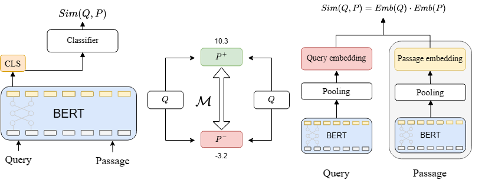

# Breaking Boundaries in Retrieval Systems: Unsupervised Domain Adaptation with Denoise-Finetuning

This repository contains the implementation of a method for **Breaking Boundaries in Retrieval Systems: Unsupervised Domain Adaptation with Denoise-Finetuning**.


## Introduction
We introduce a novel technique for **unsupervised domain adaptation** in information retrieval (IR). Our approach focuses on adapting both the dense retrieval model and the rerank model within a comprehensive two-stage retrieval system.

Our adaptation pipeline consists of three parts:
1. Generation of Pseudo Training Dataset.
2. Cross-Encoder (Rerank Model) Adaptation.
3. Bi-Encoder (Retrieval Model) Adaptation

## Installation

```
conda create -n udadf python=3.8
conda activate udadf
pip install -r requirements.txt
```

## Folder structure

| Folder Name   | Description  |
|---------------|--------------|
| bm25          | Stores testset bm25 top1000 results           |
| config        | Configuration for creating pseudo dataset            |
| datasets      | Holds original datasets downloaded via the beir package            |
| denoise_ir    | All functionalities           |
| example       | Pseudo queries and training data for the paper           |
| experiment    | Experimental scripts related to the analysis section            |
| imgs          | Images in ReadMe         |
| output        | Default directory for storing models            |
| preprocess    | Data preprocessing, downloading, or generation-related            |
| pseudo        | Default generation directory for storing generated questions and datasets            |
| scripts       | Main experiment-related scripts            |
| train_model   | Train cross-encoder and bi-encoder models          |


## Pipeline
Our experiment was conducted using a single RTX 3090 (24G). If the process runs out of virtual memory, please consider adjusting the batch size.
### Generation of Pseudo Training Dataset

As described in **Section 3.1** of the paper, we select a subset of passages from the corpus and input them into the Query Generator to generate pseudo queries. This process results in pairs comprising queries and passages. Subsequently, we employ the Cross-Encoder to assign labels to these (query, passage) pairs, resulting in the creation of triplets in the format of (query, passage, score).

```
python preprocess/build_pseudo_dataset.py \
    --config config/${dataset}.yaml
```
| Parameter                        | Description                                     |
|----------------------------------|-------------------------------------------------|
| `generate_pseudo_queries`        | Whether to generate pseudo queries            |
| `score_pseudo_qrels`             | Whether to score the pseudo qrels             |
| `create_negative_pools`        | Whether to create negative pools of queries     |
| `base_path`                      | Base path                                       |
| `dataset`                        | Dataset name  (scifact, fiqa, trec-covid)                                  |
| `prefix`                         | Prefix for output files                        |
| `new_corpus_size`                | Number of documents for pseudo query generation|
| `device`                         | Device to use                                  |
| `seed`                           | Random seed                                    |
| `pseudo_data_folder`             | Path to folder containing pseudo data          |
| `original_data_folder`           | Path to original data folder                   |
| `query_gen.batch_size`           | Batch size for the query generator             |
| `query_gen.model_path`           | Path to the query generator model              |
| `cross_train_data.top_n`         | Number of documents to retrieve initially     |
| `cross_train_data.limit_score`   | Limit score for the retriever                  |
| `cross_train_data.cross_encoder_name` | Name of cross-encoder model to use          |
| `cross_train_data.mine_batch_size` | Batch size for mining hard negatives       |
| `cross_train_data.cross_batch_size` | Batch size for the cross-encoder           |
| `cross_train_data.max_length`    | Maximum length for the cross-encoder          |
| `cross_train_data.nneg`         | Number of negative samples to mine            |
| `cross_train_data.hard_neg_name` | Name of hard negatives file                   |

### Cross-Encoder (Rerank Model) Adaptation

In previous steps, we only mined hard negative pools of queries. As mentioned in **Section 3.2** of the paper, we randomly select passages from the negative pools to form $D_{neg}$. For positive pairs in $D_{pos}$, we consider the source passages used to generate pseudo-queries as positive. Combining $D_{neg}$ and $D_{pos}$, we obtain $D_{ce}$, which we use for fine-tuning the cross-encoder.

**Build $D_{ce}$ (Section 3.2)**
+ From the scored (query, passage, relevant score) triplets obtained in step one, select the top n (default=100k) highest-scoring (query, passage, relevant score) triplets as positive samples for denoise fine-tuning.
+ Retrieve the top 1000 passages related to the queries using the BM25 and Dense retrieval models to create two negative pools, each with a size of 1000 passages.
+ Randomly select one passage each as negative samples from the negatives pool retrieved by both BM25 and the dense retrieval model.
+ Combine positive samples and negative samples to form a pseudo dataset.


**Denoise-finetuning  (Section 3.3)**

After create pseudo dataset $D_{ce} = \{(Q_i, P_i, y_i)\}, y \in \{0, 1\} $, we use pseudo dataset $D_{ce}$ for fine-tuning cross-encoder.

```
sh scripts/cross_encoder_adaptation.sh
```


The model will be saved at `output/{exp_flag}/{dataset}/{model_name}-{current_time}`. 

Under model saved folder:
- `logs`: Tensorboard logs
- `args.txt`: Args
- `train_log.txt`: Training log, including testing results
- `train_pairs.json`: Training pairs, which you can reuse in another experiment.


| Parameter                   | Description                                                  |
|-----------------------------|--------------------------------------------------------------|
| `train_pairs_path`| Use specific training pairs. |
|`exp_flag`| Customize this flag to recognize the experiment |
| `base_path`                 | Base directory for the script                                |
| `seed`                      | Random seed for reproducibility                              |
| `denoise_warmup_ratio`      | Warm-up ratio for denoising fine-tuning                       |
| `random_batch_warmup_ratio` | Warm-up ratio for random batch dropout                        |
| `random_batch_warmup_p`     | Probability of dropping a batch during random batch warm-up   |
| `warmup_ratio`              | Learning rate warm-up ratio                                   |
| `gamma`                     | Parameter used in Loss (Eq. 3)                                |
| `hard_negatives_name`       | Name of the hard negatives file                               |
| `prefix`                    | Prefix of the generate queries                                |
| `unique`                    | Use only unique (query, passage, label) triples               |
| `neg_per_model`             | Number of negative passages sampled from each model          |
| `pos_neg_ratio`             | Ratio of negative passages to positive passages              |
| `neg_retrievers`            | Retrievers used to sample negative passages                   |
| `skip_top_n`                | Number of negative passages to skip from the top                      |
| `use_top_n`                 | Number of negative passages to use from the top                        |
| `sample_mode`               | Sampling mode for negative passages                                    |
| `device`                    | CUDA device for training                                      |
| `lr`                        | Learning rate for training                                    |
| `train_batch_size`          | Batch size for training                                       |
| `num_epochs`                | Number of training epochs                                     |
| `model_name`                | You can include additional models in the `train_model/train_cross.py` file by adding entries in the `model_name_mapping` dictionary with the format {model_name:path}. To use multiple models for co-regularization, separate their names with '@'. For instance, you can specify `model_name` as either 'L12@L12' or 'L6@L12'. |
| `max_seq_length`            | Maximum length of input sequence                              |
| `use_amp`                   | Use automatic mixed precision training                        |
| `dataset`                   | Dataset name                                                 |
| `test_dataset`              | Test dataset name                                            |
| `test_retrieval_result`     | Path to test retrieval results file                           |
| `max_test_samples`          | Number of samples used for model evaluation                   |
| `generated_path`            | Path for pseudo dataset                                       |


### Bi-Encoder (Retrieval Model) Adaptation

 As mentioned in **Section 3.4** of the paper, knowledge is distilled from both the adapted cross-encoder and the unadapted cross-encoder models to the bi-encoder.



**Labeling Margins**
+ We labeling margins are calculated using the formula: margin = CE(query, positive passage) - (query, negative passage) (Eq. 7).
+ Fill in the path of the adapted_cross_encoder into the cross-encoder trained in Section Denoise-finetuning.

```bash
sh scripts/build_distillation_dataset.sh
```
| Parameter | Description |
| - | - |
| unadapted_cross_encoder | The cross-encoder model that has not undergone domain adaptation. |
| adapted_cross_encoder | The cross-encoder model that has been adapted to the domain. Please provide the cross-encoder model trained in the previous step. |
| path_to_generated_data | The folder containing pseudo queries. |

**Training bi-encoder with margins**
```
sh scripts/bi_encoder_adaptation.sh
```


# Evaluation

To perform two-stage retrieval evaluation, please execute the following command:

```bash
python evaluation/two_stage.py
```

| Parameter | Description |
| --------- | ----------- |
| `rerank_model` | Path to the rerank model |
| `retrieval_model` | Path to the retrieval model |
| `dataset` | Name of the dataset |
| `retrieval_batch_size` | Batch size for first-stage retrieval |
| `rerank_batch_size` | Batch size for rerank model |
| `split` | Data split: 'dev' or 'test' (some datasets may not have a dev set) |
| `top_k` | Number of results from the first-stage retrieval to use for reranking |
| `saved_retrieval_result` | Load retrieval results (retrieval results are in pickle format) |"


**Acknowledgement**
This code is based on [beir](https://github.com/beir-cellar/beir), [sentence-transformers](https://github.com/UKPLab/sentence-transformers), and [gpl](https://github.com/UKPLab/gpl). We would like to express our gratitude for their high-quality code and efforts.